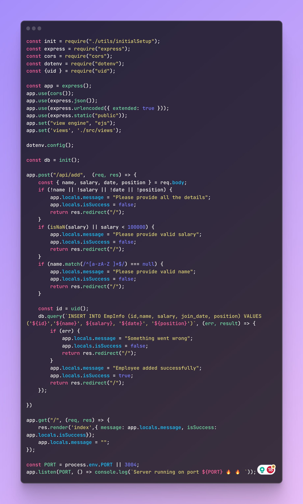
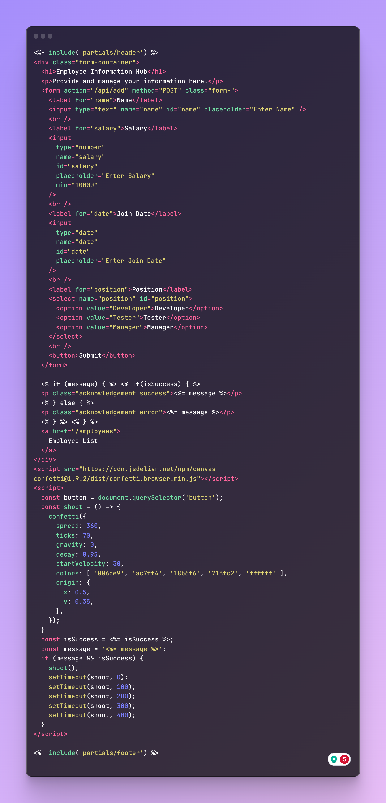
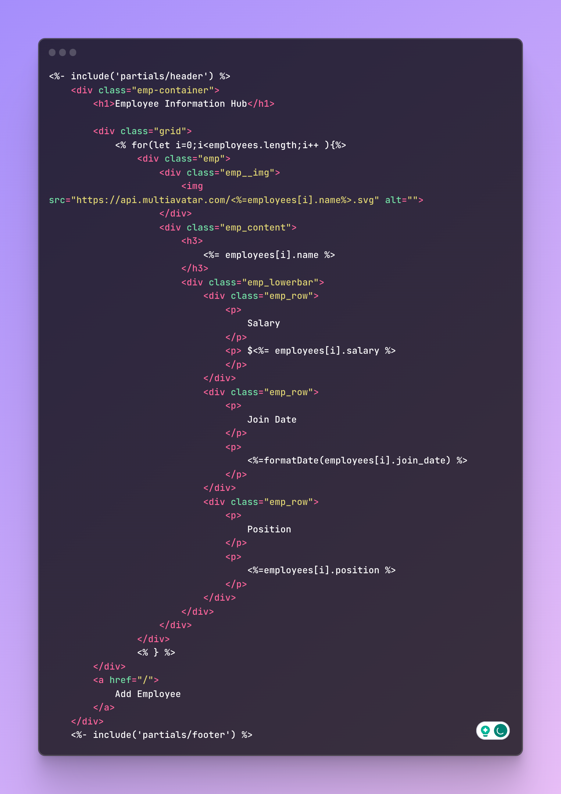
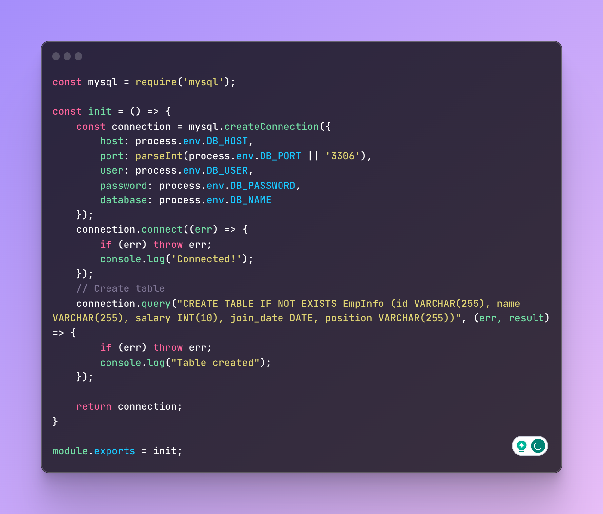

  

## SEP Topic 80
Install nodejs and npm with respective version 8.10 and 3.5.2 to perform following server side scripting problem.
Install the NPM package ‘mysql’ and create one db with table name “EmpInfo” having 5 records of Employee information.

### Mentor: Prof. Nirav Suthar

### TEAM

| Name          | Enrollment No.  | Roll No | Sem |
| ------------- | --------------- | ------- | --- |
| Heet Vakharia | 202201619010226 | B114    | 4   |
| Lisha Modhiya | 202201619010156 | B42     | 4   |
| Honey Patel   | 202201619010292 | C62     | 4   |
| Shreena Shah  | 202201619010200 | B88     | 4   |
| Sakshi Patel  | 202201619010173 | B60     | 4   |

### Intro to Nodejs
Node.js is a powerful, open-source, cross-platform JavaScript runtime environment built on Chrome's V8 JavaScript engine. Developed by Ryan Dahl in 2009, Node.js enables developers to run JavaScript code outside the web browser, allowing them to build scalable, high-performance network applications. It utilizes an event-driven, non-blocking I/O model, making it efficient for handling asynchronous operations commonly found in web development.

One of the key features of Node.js is its package ecosystem, managed by npm (Node Package Manager). npm is the world's largest software registry, housing over a million packages of reusable code. It allows developers to easily install, share, and manage dependencies for their projects. With npm, developers can quickly integrate libraries, frameworks, and tools into their applications, significantly speeding up the development process.

Node.js is widely used in both frontend and backend development, powering various types of applications such as web servers, APIs, microservices, and command-line tools. Its lightweight, event-driven architecture makes it ideal for building real-time applications, streaming services, and IoT (Internet of Things) devices. Combined with npm's extensive ecosystem, Node.js empowers developers to create robust, scalable, and feature-rich applications with JavaScript, making it a popular choice in the development community.

### Installing Nodejs and npm
1. Linux 
- We can install nodejs and npm using the following commands:
  - Update the package index - `sudo apt-get update`
  - Download the script from nodesource and run it - `curl -sL https://deb.nodesource.com/setup_8.10 -o /tmp/nodesource_setup.sh`
  - Configure the package repository - `sudo bash /tmp/nodesource_setup.sh`
  - Install nodejs - `sudo apt-get install nodejs`
  - You can verify the installation using the following commands:
    - `node -v`
    - `npm -v`
1. MacOS and Windows
- Download the installer from the [Nodejs Old Download](https://nodejs.org/dist/v8.10.0/)
- After Downloading the installer, run the installer and follow the instructions.
- After installation, check the version of nodejs and npm using the following commands:
  - `node -v`
  - `npm -v`

### Installing dependencies
- To install the dependencies, run the following command:
  - `npm install`
  - This will install all the dependencies mentioned in the package.json file.
  - The dependencies are:
    - express
      - Express is a minimal and flexible Node.js web application framework that provides a robust set of features for web and mobile applications.
    - mysql
      - Mysql is a nodejs driver for mysql database.
    - ejs
      - EJS is a simple templating language 
    - dotenv
      - Dotenv is a zero-dependency module that loads environment variables from a .env file into process.env.
    - uid
      - UID is a module that generates unique ids.
    - cors
      - Cors is a nodejs package for providing a Connect/Express middleware that can be used to enable CORS with various options.
  - The dev dependencies are:
    - nodemon
      - Nodemon is a tool that helps develop node.js based applications by automatically restarting the node application when file changes in the directory are detected.
- Rename the .env.example file to .env and add the database credentials in the .env file.

### Running the application
- To run the application, run the following command:
  - `npm start`
- This will start the application on port 3004.

### API Endpoints

| Endpoint       | Description                                  |
| -------------- | -------------------------------------------- |
| GET /          | This will return the home page               |
| GET /employees | This will return all employees page          |
| POST /api/add  | This will add a new employee to the database |

### Database Schema
- The database schema is as follows:
  1. Employees table
     1. id - varchar(255) - Primary Key
     2. name - varchar(255)
     3. salary - int(10)
     4. join_date - date
     5. position - varchar(255)

### API Documentation

#### GET /
- This will return the home page.
- The home page will have a form to add a new employee.
- Will pass 2 parameters to the ejs file:
    1. message - This will contain the message to be displayed on the home page.
    2. isSuccess - This will contain a boolean value to check if the operation was successful or not.

#### POST /api/add
- This will add a new employee to the database.
- The request body will contain the following parameters:
  1. name - This will contain the name of the employee.
  2. salary - This will contain the salary of the employee.
  3. join_date - This will contain the joining date of the employee.
  4. position - This will contain the position of the employee.
- The response will update local variables and redirect to the home page.
- Possible responses:
  1. 200 - The employee was added successfully.
  2. 400 - The request body was invalid.
  3. 500 - There was an error while adding the employee to the database.

#### GET /employees
- This will return all the employees in the database.
- The response will contain the following parameters:
  1. employees - This will contain the list of all the employees in the database.
  2. formatDate - This will contain a function to format the date.
- Possible responses:
  1. 200 - The employees were fetched successfully.
  2. 500 - There was an error while fetching the employees from the database.

### Output 
[Live Demo](https://cute-rose-crayfish-sari.cyclic.app)

### Source Code

- index.js - [src/index.js](https://github.com/vakhariaheet/SEP-Emp-Form/blob/nodev8/src/index.js)

- index.ejs - [src/views/index.ejs](https://github.com/vakhariaheet/SEP-Emp-Form/blob/nodev8/src/views/index.ejs)

- emp - [src/views/emp.ejs](https://github.com/vakhariaheet/SEP-Emp-Form/blob/nodev8/src/views/emp.ejs)

- initialSetup.js - [src/utils/initialSetup.js](https://github.com/vakhariaheet/SEP-Emp-Form/blob/nodev8/src/utils/initialSetup.js)

- app.css - [public/app.css](https://github.com/vakhariaheet/SEP-Emp-Form/blob/nodev8/public/app.css)

**Note** - Only the important files are shown here. To view all the files, please visit the [github repository](https://github.com/vakhariaheet/SEP-Emp-Form/blob/nodev8).